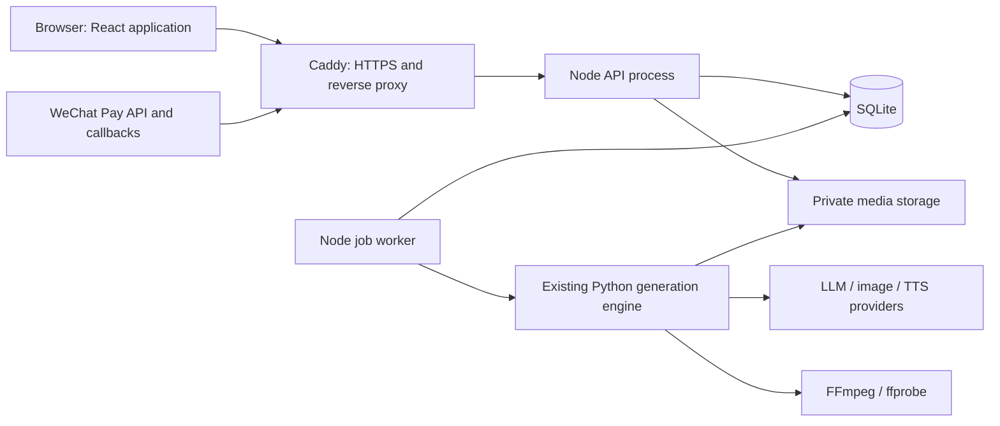
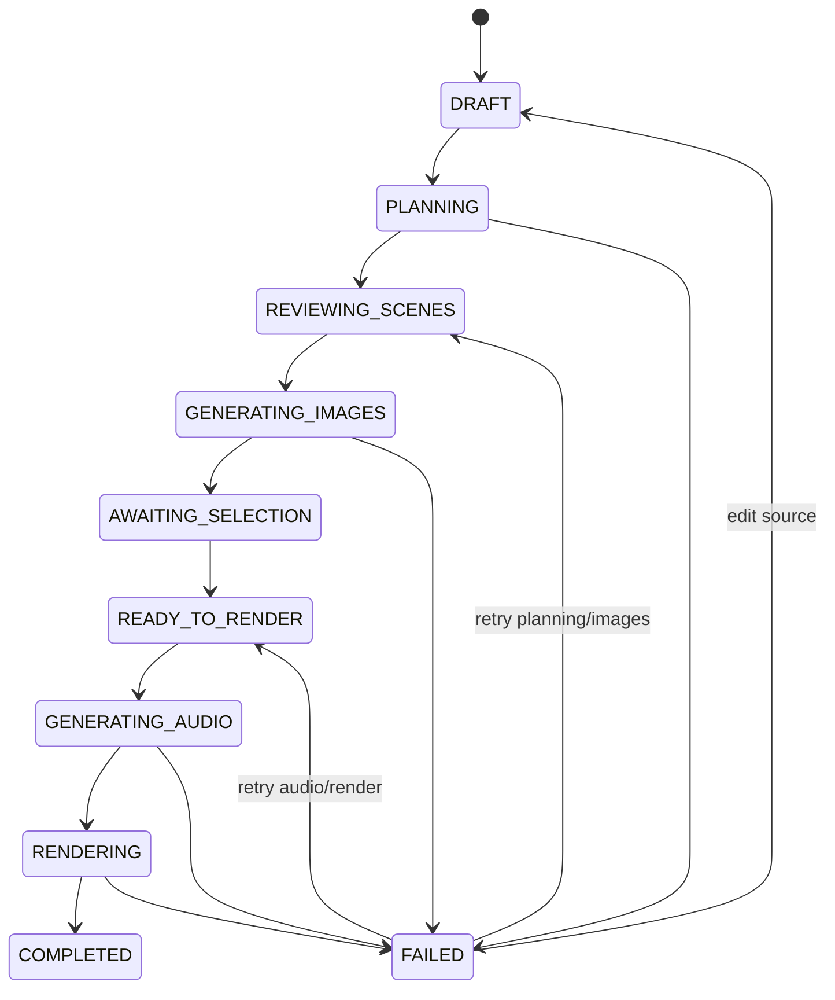

# Podcast Story Platform Redesign Specification

Status: Approved implementation baseline

Date: 2026-08-16

Scope: Product, UX, application architecture, data model, security, billing, deployment, migration, and acceptance criteria

## 1. Executive summary

StoryVideoGen will become a multi-user web product for turning a long story into a narrated slideshow-style podcast video. The experience will guide a user from story input through scene planning, image selection, narration, rendering, and download. It will also add a durable story library, WeChat Pay subscription purchases, user-managed provider keys, and role-protected administration.

The recommended architecture is:

- Node.js 24 LTS with TypeScript owns the web application, REST API, authentication, authorization, subscriptions, durable jobs, administration, and SQLite data.
- React and Vite provide the browser UI.
- The existing tested Python modules remain the media-generation engine in the first release. A Node worker invokes them through a narrow, structured job interface.
- SQLite becomes the source of truth for users, stories, chunks, jobs, subscriptions, payments, and provider-key metadata. Generated media remains on disk and is referenced by opaque asset IDs.
- Caddy terminates HTTPS and reverse proxies only to the Node server. The worker and Python engine are not publicly reachable.

This approach satisfies the Node.js and SQLite requirement without discarding the working image, TTS, subtitle, and FFmpeg implementation. A complete Python-to-Node media rewrite would add significant risk without improving the initial product outcome.

## 2. Confirmed requirements

The following requirements are treated as decided:

1. A user can create a named story by pasting story text.
2. The system divides the story into ordered chunks/scenes and produces multiple image prompts per chunk.
3. The system generates image candidates through AI generation, image search, or manual upload and requires the user to select one image for each chunk.
4. The system generates narration with TTS and renders a full podcast-style video from the selected images and audio.
5. A user library shows drafts, active generations, failures, and completed podcast videos.
6. A subscription page accepts WeChat Pay.
7. A settings page allows a user to configure provider API keys.
8. Admin-only pages list users and their generated stories and manage platform LLM/provider keys.
9. A persistent left sidebar switches between product areas.
10. The visual language is minimal, professional, and suitable for long-running creative work.
11. The application uses Node.js, SQLite, and an HTTPS reverse proxy.
12. The current media-generation pipeline should be reused where practical.

## 3. Current system assessment

### 3.1 What already works

The existing project has a meaningful generation core rather than a prototype shell:

- Story parsing and deterministic chunking.
- Optional Chinese translation and Simplified Chinese subtitles.
- LLM-backed or heuristic image-prompt generation.
- Multiple image providers, including generated-image and image-search sources.
- Multiple image candidates per chunk and manual image upload.
- User selection of a candidate for every chunk.
- Edge TTS or silent test audio.
- FFmpeg title card, image slideshow, narration, optional background music, and final MP4 rendering.
- Attribution and license manifests.
- Username/password authentication, hashed session tokens, CSRF protection, rate limits, quotas, and user-scoped paths.
- SQLite persistence for users, sessions, daily usage counters, and user API keys.
- Unit, integration, render, and browser end-to-end coverage.
- A Caddy and systemd deployment starting point.

### 3.2 Current architecture

- Python 3.11+ is the application and generation runtime.
- `storyvideogen/ui_server.py` combines HTTP routing, authentication checks, job orchestration, file serving, test seeding, and a duplicate fallback UI in one large module.
- `web/src/main.js` is a single vanilla JavaScript client built with Vite.
- SQLite stores account-related records only.
- Each story's product state is spread across JSON manifests and media files in a user directory.
- Prepare jobs run in daemon threads. Compose jobs use an in-memory Python queue and worker threads.
- Job polling relies on in-memory dictionaries.
- Caddy currently proxies directly to the Python HTTP server.

### 3.3 Gaps that affect the redesign

1. **The current workflow is not truly long-form.** It calculates a target word count and calls `select_target_excerpt`, so content outside the target duration can be omitted.
2. **Jobs are not durable.** Restarting the process loses queue and polling state even when some story files remain.
3. **There are two sources of truth.** SQLite owns accounts while JSON files and filenames imply story state.
4. **Story identity is path-based.** Browser APIs exchange server filesystem paths. Product APIs should expose stable IDs instead.
5. **The server is a monolith.** Billing, admin behavior, additional roles, and recovery would make `ui_server.py` harder to maintain safely.
6. **Admin is only a configured username check.** There are no admin data or key-management endpoints and no persisted roles.
7. **Provider keys are stored as plaintext values in SQLite.** Values are not returned to the UI, but storage encryption is required for a hosted product.
8. **No subscription or payment domain exists.** Plans, orders, callbacks, entitlements, reconciliation, and audit data must be added.
9. **TTS is produced as one narration asset.** Per-chunk audio is preferable for retrying, replacing, and retiming long episodes.
10. **Packaging currently needs repair.** Editable Python installation fails because setuptools discovers unrelated top-level directories after the web/deployment additions. Package discovery must be explicit during implementation.

## 4. Product model and terminology

Use consistent user-facing terms:

- **Story**: the editable source project.
- **Scene**: an ordered story chunk with narration text, prompts, image candidates, one selected image, and optional scene audio.
- **Episode**: the completed podcast video and downloadable artifacts.
- **Generation**: a durable background job for planning, images, speech, or rendering.
- **Library**: all stories and episodes belonging to the signed-in user.
- **Provider key**: a credential for LLM, image, TTS, or search services.

Avoid exposing internal terms such as `output_dir`, manifest filenames, queue names, or Python provider class names.

## 5. Information architecture

### 5.1 Application shell

The authenticated application uses a fixed left navigation rail on desktop and a slide-out drawer on narrow screens.

Primary navigation:

1. **Create** — start a new story or continue the active editor.
2. **Library** — drafts, generating, completed, and failed stories.
3. **Subscription** — current plan, usage, available plans, and payment history.
4. **Settings** — provider keys, generation defaults, account, and security.

Admin navigation appears only when `role = admin`:

5. **Users** — user search, status, subscription, usage, and story counts.
6. **All Stories** — cross-user story and generation visibility.
7. **Service Keys** — platform-managed LLM, image, TTS, and search credentials.

The bottom of the sidebar contains the signed-in identity, role badge when applicable, and logout.

### 5.2 Routes

| Route | Audience | Purpose |
|---|---|---|
| `/create` | User | New story form and most recent draft |
| `/stories/:storyId` | Owner, authorized admin | Story editor and workflow |
| `/library` | User | Filterable story/episode library |
| `/subscription` | User | Plan, usage, WeChat payment, order history |
| `/settings/providers` | User | Personal provider credentials |
| `/settings/account` | User | Password and account settings |
| `/admin/users` | Admin | User administration |
| `/admin/stories` | Admin | Cross-user story and job list |
| `/admin/providers` | Admin | Platform provider credentials |

## 6. Core user journeys

### 6.1 Create and plan a story

The Create page contains:

- Story name.
- Full story text area with word and estimated-duration counts.
- Source language and narration language.
- Video preset: fixed 1920×1080 landscape 16:9 for version 1.
- Voice preset.
- Optional advanced settings collapsed by default.
- Primary action: **Create story and plan scenes**.

Submitting immediately creates a durable draft before starting a planning job. The user can leave the page without losing work.

The planner processes the entire accepted story, not a target-duration excerpt. The LLM returns structured ordered scenes. Server validation enforces:

- Complete coverage without accidental gaps.
- Original order.
- Non-empty scene text.
- Configured minimum and maximum scene size.
- A maximum scene count derived from product limits.

If LLM output is invalid after bounded retries, the existing deterministic sentence splitter provides a recoverable fallback and the UI identifies that fallback was used.

Zhipu through the existing ZAI SDK is the version-1 text LLM for full-story scene planning, Simplified Chinese narration/translation, and visual-prompt generation. The same Zhipu/BigModel credential is stored canonically as `ZAI_API_KEY` and may authorize both text models and the Zhipu `glm-image` provider. Text and image model names remain separately configurable. DeepSeek is deferred until after version 1.

### 6.2 Review scenes and prompts

After planning, the story editor displays a vertical scene list. Each scene includes:

- Scene number and estimated duration.
- Source text.
- Narration/translated text.
- Two or more proposed visual prompts.
- Edit and regenerate actions, subject to plan quotas.

The user may review and edit before spending image-generation quota. Reordering or materially editing scenes invalidates downstream images/audio for only the affected scenes.

### 6.3 Generate and select images

The user starts image generation for all scenes or one failed scene. Each scene card shows independent progress and candidate results as they arrive.

Launch image-source classes are:

- **AI generation**: retain the existing Zhipu and SiliconFlow providers.
- **Existing image search**: retain the current Baidu, Pixabay, Openverse, and Wikimedia implementations without adding new search providers or search transports.
- **Manual upload**: retain browser image upload.

Search results keep provider, source URL, creator, license, and dimension metadata when the existing provider supplies it. Version 1 does not add image-rights verification, selection blocking, or user attestation. Baidu results remain selectable. No Brave, MCP, or other new image-search integration is in scope.

For every scene, the user can:

- Select one candidate.
- Enlarge a candidate.
- Regenerate candidates.
- Edit a prompt and generate from it.
- Upload a local replacement image.
- See provider attribution/license information when the source requires it.

The **Continue to audio** action remains disabled until every non-skipped scene has one selected image. Failed candidates do not block the story if another valid candidate is selected.

### 6.4 Configure audio and render

The Audio step contains:

- TTS provider and voice.
- Short voice preview.
- Narration speed if supported.
- Optional background-music upload, preview, volume, and loop toggle.
- Simplified Chinese subtitles are burned into the MP4 and also remain available as a downloadable SRT. Long scene narration is divided into short, contiguous subtitle cues without changing image timing.

The UI shows an estimated output duration and quota/cost impact before rendering.

Rendering uses per-scene TTS assets. Completed scene audio durations determine slideshow timing and subtitle timing. Unchanged audio and images are reused after retries.

### 6.5 Completion

The completion view provides:

- In-browser video player.
- Download MP4.
- Download SRT.
- Download narration text.
- Download credits/license manifest when applicable.
- Retry render with different music/volume without regenerating scenes or images.
- Return to Library.

### 6.6 Library

The Library page defaults to newest activity and supports:

- Tabs: All, Drafts, Generating, Ready for selection, Completed, Failed.
- Search by story name.
- Card/list view with title, status, progress, updated date, duration, and thumbnail.
- Continue, view, retry, and download actions appropriate to status.
- Archive action and scheduled permanent deletion after a configurable grace period, initially 30 days.

Active jobs update through server-sent events (SSE), with ordinary polling as a fallback. Reloading or logging in from a second browser must show the same durable state.

### 6.7 Subscription and WeChat Pay

Version 1 uses time-limited plans purchased as one-time WeChat Native Pay orders, not automatic recurring debit.

The Subscription page shows:

- Current plan and expiry.
- Remaining usage for the billing period.
- Plan comparison cards.
- **Pay with WeChat** action.
- QR-code payment modal with amount, expiry countdown, and live order status.
- Payment/order history.

Native Pay is appropriate for a desktop browser: the server creates an order, receives a `code_url`, and the browser renders it as a QR code. WeChat's current documentation describes this desktop flow and requires payment completion to be confirmed by a signed callback and/or order query, not by trusting the browser ([Native Pay development guide](https://pay.wechatpay.cn/doc/v3/merchant/4012791891)).

Payment flow:

1. Node creates an internal immutable order in `pending` state with amount in integer fen.
2. Node calls WeChat Pay API v3 Native order creation using a unique `out_trade_no`.
3. Browser displays a QR code from `code_url` and polls the internal order status.
4. WeChat calls the public callback endpoint.
5. The server verifies the callback signature from the original raw request body, decrypts the resource using the API v3 key, validates merchant/app/order/amount fields, and applies the event idempotently.
6. The callback returns promptly; entitlement activation and audit work occur transactionally/asynchronously.
7. A reconciliation task queries old pending orders because WeChat explicitly says merchants must not depend only on callbacks ([payment callback guide](https://pay.wechatpay.cn/doc/v3/merchant/4012791861)).

The callback endpoint must tolerate duplicates. Notification ID and WeChat transaction ID are unique idempotency keys. Secrets, private keys, decrypted callback payloads, and full payment QR URLs must not be logged.

WeChat merchant onboarding is a product dependency, not only an engineering task. Native Pay currently requires an eligible organization/sole proprietor and a bound application ID ([Native Pay product requirements](https://pay.wechatpay.cn/doc/v3/merchant/4012791874), [merchant ID and app ID guide](https://pay.wechatpay.cn/doc/v3/merchant/4012071573)).

## 7. Visual design specification

### 7.1 Design direction

The interface should feel like a calm production workspace rather than an AI demo.

- Background: cool neutral `#F6F7F9`.
- Surfaces: white with subtle `#E5E7EB` borders.
- Primary text: `#111827`; secondary text: `#667085`.
- Product accent: restrained indigo `#4F46E5` for primary actions and progress.
- Success: `#15803D`; warning: `#B45309`; destructive: `#B42318`.
- WeChat green is reserved for the WeChat Pay action so payment identity remains clear.
- Typography: Inter for Latin text and `Noto Sans SC` for Simplified Chinese fallback.
- Eight-pixel spacing system; 10-12px corner radii; shadows only for overlays and selected media.
- Avoid decorative gradients, oversized hero typography, pill-shaped buttons everywhere, and dense all-caps labels.

### 7.2 Layout

- Sidebar: 240px expanded desktop width; icon-only 72px intermediate state; drawer below 900px.
- Content: maximum 1440px, with the story editor allowed to use the full width.
- Page header: title, contextual status, and one primary action.
- Story workflow: compact horizontal stepper above the editor.
- Scene workspace desktop split: scene text/prompts on the left and image candidates on the right.
- Long lists use incremental rendering/pagination so a long story does not produce an unusable DOM.

### 7.3 Interaction rules

- Autosave after a short idle interval and on step transitions; always show `Saving`, `Saved`, or actionable failure.
- Every background stage has queued/running/progress/failure/retry states.
- Destructive or quota-consuming actions state their effect before confirmation.
- Do not erase a previous successful asset until a replacement succeeds.
- Keyboard focus, labels, color contrast, and error association target WCAG 2.2 AA.
- Reduced-motion preference disables decorative animation; generation progress remains understandable without animation.

### 7.4 Page-level wireframes

Story editor desktop:

```text
┌──────────── Sidebar ────────────┬──────────────── Story name / status ────────────────┐
│ Create                          │ Story · Scenes · Images · Audio · Render            │
│ Library                         ├───────────────────────────────────────────────────────┤
│ Subscription                    │ Scene 12 of 38            [Regenerate] [Save]        │
│ Settings                        │ ┌──────────────────────┬────────────────────────────┐ │
│                                 │ │ Source/narration     │ Image candidate grid       │ │
│ Admin (role-gated)              │ │ Prompt editor        │ Selected / failed states   │ │
│                                 │ └──────────────────────┴────────────────────────────┘ │
│ User / Logout                   │ Previous scene                    Next scene →        │
└─────────────────────────────────┴───────────────────────────────────────────────────────┘
```

Library desktop:

```text
┌──────────── Sidebar ────────────┬──────────────────── Library ─────────────────────────┐
│ ...                             │ Search       All Draft Generating Completed Failed   │
│                                 ├───────────────────────────────────────────────────────┤
│                                 │ Thumbnail  Title / updated   Progress   Status Action │
│                                 │ Thumbnail  Title / updated   Duration   Ready  View   │
└─────────────────────────────────┴───────────────────────────────────────────────────────┘
```

## 8. Recommended application architecture

### 8.1 Runtime and frameworks

- **Node.js 24 LTS** for production. Node's release page identifies v24 as LTS as of this specification date and recommends production use of Active or Maintenance LTS releases ([Node.js release policy](https://nodejs.org/en/about/previous-releases)).
- **TypeScript** in strict mode for the Node server, shared API contracts, and browser client.
- **Fastify 5** for HTTP routing, schema validation, secure body limits, logging, and modular route registration. Fastify's current reference documents v5 and its plugin-based encapsulation model ([Fastify reference](https://fastify.dev/docs/latest/Reference/)).
- **React 19 + Vite** for the browser UI. This replaces the single imperative `main.js` with route- and feature-level components.
- **better-sqlite3** behind small repository modules, with explicit SQL migrations. Node's built-in `node:sqlite` remains release-candidate stability in Node 24, while better-sqlite3 supplies a mature transactional API and LTS prebuilt binaries ([Node SQLite status](https://nodejs.org/download/release/latest-v24.x/docs/api/sqlite.html), [better-sqlite3 project](https://github.com/WiseLibs/better-sqlite3)).
- **Python 3.12 worker environment** for the current generation implementation and FFmpeg integration.
- **Caddy** for public HTTPS, compression, security headers, and reverse proxying to `127.0.0.1`. A hostname enables automatic HTTPS in Caddy's documented setup ([Caddy HTTPS guide](https://caddyserver.com/docs/quick-starts/https), [reverse proxy reference](https://caddyserver.com/docs/caddyfile/directives/reverse_proxy)).

Versions are pinned in lockfiles and deployment artifacts. Major upgrades are deliberate, tested changes.

### 8.2 Process topology



Use two service entry points from one Node codebase:

- `server`: request/response work, static UI, SSE, authentication, payments, and admin APIs.
- `worker`: durable job claiming, provider calls, Python process supervision, retries, and state transitions.

This keeps the API responsive during long generation while avoiding an additional message-broker dependency. SQLite is the queue for the first single-host release.

### 8.3 Module boundaries

```text
server/
  src/
    auth/           users, passwords, sessions, CSRF
    stories/        stories, scenes, selections, library
    jobs/           durable queue, events, retry/cancel
    assets/         upload, metadata, authorization, download
    providers/      user/platform credential resolution
    billing/        plans, orders, subscriptions, usage
    admin/          admin-only queries and commands
    db/             connection, migrations, repositories
    http/           app bootstrap, schemas, common errors
    worker/         job runner and Python adapter
web/
  src/
    app/            routing, shell, session bootstrap
    features/       story, library, billing, settings, admin
    components/     reusable accessible UI components
storyvideogen/      existing Python media engine
tests/
deploy/
```

Feature modules own their routes, application service, repository, and tests. Cross-feature writes go through application services rather than importing another feature's SQL. Shared abstractions are introduced only when two real consumers need them.

### 8.4 Node-to-Python contract

Node starts Python with an executable plus an argument array; it never builds a shell command from user content.

Each stage receives validated JSON containing IDs, settings, and private storage paths. Python emits newline-delimited JSON progress events to stdout and structured errors to stderr. Events include:

- `stage_started`
- `progress`
- `asset_created`
- `stage_completed`
- `stage_failed`

The initial Python refactor should expose four independently retryable operations:

1. `plan_story`
2. `generate_scene_images`
3. `synthesize_scene_audio`
4. `render_episode`

Node owns authoritative state transitions. Python owns media and provider-specific work. The contract is versioned and contract-tested so the engine could later be replaced without rewriting billing, admin, or UI code.

## 9. Durable workflow design

### 9.1 Story state machine



Story status is persisted, not inferred from filenames. Scene-level state records partial success.

### 9.2 Job semantics

- States: `queued`, `running`, `succeeded`, `failed`, `cancel_requested`, `cancelled`.
- A worker claims one job in a short `BEGIN IMMEDIATE` transaction and assigns a lease.
- The worker renews the lease while the child process is healthy.
- Expired running jobs return to queued only when their operation is retry-safe.
- Retry count and next-attempt time are persisted with bounded exponential backoff.
- Every transition appends a `job_event` for UI progress and diagnosis.
- Idempotency keys prevent double planning, double rendering, or duplicate payment orders from repeated browser requests.
- Cancellation terminates the child process, marks temporary outputs abandoned, and preserves prior successful assets.

### 9.3 Long-story behavior

- Store the complete source text.
- Plan in bounded windows when content exceeds one LLM context request.
- Carry a compact story bible between windows: characters, locations, visual style, timeline, and last-scene context.
- Validate full source coverage after merging windows.
- Generate images with bounded concurrency by provider and user plan.
- Synthesize narration per scene to make retry and timing local.
- Render from a generated FFmpeg concat plan rather than holding media in memory.
- Persist stage checkpoints so only incomplete work resumes after restart.

## 10. SQLite data design

SQLite is authoritative for metadata and workflow state. Media bytes remain outside the database.

Use:

- `PRAGMA foreign_keys = ON` for every connection because SQLite does not guarantee it is enabled by default ([SQLite foreign-key documentation](https://www.sqlite.org/foreignkeys.html)).
- WAL mode and a busy timeout for this single-host, read-heavy workload.
- `STRICT` tables where compatible.
- UTC timestamps in a single RFC 3339 text representation.
- Integer fen for money and integer milliseconds/bytes for measured values.
- Explicit migrations with a schema-version table; no schema creation during normal requests.

### 10.1 Core tables

| Table | Key fields and purpose |
|---|---|
| `users` | `id`, `username`, optional identity fields, `password_hash`, `role`, `status`, timestamps |
| `sessions` | hashed token, `user_id`, CSRF secret/hash, expiry, last-seen metadata |
| `stories` | `id`, `user_id`, title, full source text, languages, status, progress, config JSON, timestamps, version |
| `scenes` | `id`, `story_id`, position, source text, narration text, summary, status, estimated duration, selected image ID |
| `image_prompts` | `id`, `scene_id`, prompt text, provider/model, position, status, version |
| `assets` | `id`, owner/story/scene, kind, storage key, MIME, bytes, dimensions/duration, checksum, status |
| `image_candidates` | `id`, `scene_id`, prompt ID, asset ID, provider/model, status, attribution/license fields, error |
| `jobs` | `id`, owner/story, type, state, progress, attempt, lease, idempotency key, payload, error, timestamps |
| `job_events` | monotonic event ID, job ID, type, safe payload, timestamp |
| `provider_secrets` | scope (`user`/`platform`), owner, provider, encrypted value, nonce/tag, last four, status, timestamps |
| `plans` | code, display name, active flag, price fen, period days, quota JSON, sort order |
| `payment_orders` | internal ID, user/plan, unique merchant order number, amount, state, QR expiry, WeChat transaction ID, timestamps |
| `payment_events` | unique notification ID, order ID, event type, processing state, safe audit metadata |
| `subscriptions` | user, plan, state, period start/end, originating order, timestamps |
| `usage_ledger` | user, subscription/period, unit type, quantity, story/job reference, timestamp |
| `admin_audit_log` | actor, action, target type/ID, safe change metadata, request ID, timestamp |

Indexes must cover library filtering (`user_id`, `status`, `updated_at`), active-job claiming, payment lookup, subscription expiry, and admin search.

### 10.2 Asset storage

Recommended layout:

```text
/var/lib/storyvideogen/
  app.sqlite3
  storage/
    users/<user-id>/stories/<story-id>/
      source/
      scenes/<scene-id>/images/
      scenes/<scene-id>/audio/
      renders/<render-id>/
      uploads/
  tmp/
```

Clients receive asset IDs and authorized URLs, never server paths. Uploads and provider downloads go to a temporary file, are size/type checked, checksummed, then atomically renamed. Generated asset filenames are server-created UUIDs.

SQLite and the storage directory form one backup set. A successful restore requires both from a consistent checkpoint.

## 11. API design

All product routes use `/api/v1`. JSON errors use stable codes plus human-readable messages. Request validation rejects unknown or out-of-range settings.

### 11.1 Authentication and account

| Method | Endpoint | Purpose |
|---|---|---|
| `POST` | `/auth/register` | Create an account |
| `POST` | `/auth/login` | Create a session |
| `POST` | `/auth/logout` | Revoke the current session |
| `GET` | `/auth/me` | Current user, role, entitlements, CSRF token |
| `POST` | `/account/password` | Change password |

### 11.2 Stories and generation

| Method | Endpoint | Purpose |
|---|---|---|
| `GET` | `/stories` | Owner-scoped library filters and pagination |
| `POST` | `/stories` | Create durable draft |
| `GET` | `/stories/:id` | Story, scenes, assets, active job summary |
| `PATCH` | `/stories/:id` | Autosave editable story metadata/config |
| `POST` | `/stories/:id/actions/plan` | Queue scene planning |
| `POST` | `/stories/:id/actions/generate-images` | Queue missing/stale images |
| `PATCH` | `/scenes/:id` | Edit scene narration/prompt inputs with version check |
| `PUT` | `/scenes/:id/selected-image` | Select one owned, ready image |
| `POST` | `/scenes/:id/images` | Upload or regenerate candidates |
| `POST` | `/stories/:id/actions/render` | Queue TTS and rendering |
| `POST` | `/jobs/:id/actions/cancel` | Request cancellation |
| `POST` | `/jobs/:id/actions/retry` | Retry an eligible failed job |
| `GET` | `/jobs/:id` | Durable job state |
| `GET` | `/events` | Owner-scoped SSE job/story updates |
| `GET` | `/assets/:id` | Authorized inline asset stream |
| `GET` | `/assets/:id/download` | Authorized attachment download |

Updates use a `version` field or `If-Match` to prevent two tabs silently overwriting each other.

### 11.3 Provider settings

| Method | Endpoint | Purpose |
|---|---|---|
| `GET` | `/settings/providers` | Configured/missing status only |
| `PUT` | `/settings/providers/:provider` | Store or rotate a personal secret |
| `DELETE` | `/settings/providers/:provider` | Remove a personal secret |
| `POST` | `/settings/providers/:provider/test` | Safe connection test with strict rate limit |

### 11.4 Billing

| Method | Endpoint | Purpose |
|---|---|---|
| `GET` | `/billing/plans` | Active plan catalog |
| `GET` | `/billing/subscription` | Current entitlement and usage |
| `GET` | `/billing/orders` | Owner payment history |
| `POST` | `/billing/orders` | Create idempotent WeChat Native Pay order |
| `GET` | `/billing/orders/:id` | Poll internal order status |
| `POST` | `/webhooks/wechat-pay` | Public verified callback; no session/CSRF |

### 11.5 Admin

| Method | Endpoint | Purpose |
|---|---|---|
| `GET` | `/admin/users` | Paginated/searchable users with aggregates |
| `GET` | `/admin/users/:id` | User status, plan, usage, and story summaries |
| `PATCH` | `/admin/users/:id/status` | Suspend/reactivate subject to policy |
| `GET` | `/admin/stories` | Cross-user story/job filters |
| `GET` | `/admin/stories/:id` | Authorized story details |
| `GET` | `/admin/providers` | Platform credential health/status |
| `PUT` | `/admin/providers/:provider` | Store/rotate platform secret |
| `DELETE` | `/admin/providers/:provider` | Disable/remove platform secret |
| `POST` | `/admin/providers/:provider/test` | Test platform provider connectivity |

Every admin mutation writes an audit record. Neither admin nor user APIs ever return a stored secret.

## 12. Provider key model

Provider credentials support two scopes:

- **User key**: supplied by a user and used only for that user's jobs.
- **Platform key**: configured by an admin and available according to plan policy.

Recommended resolution order: eligible user key first, then eligible platform key, otherwise fail before queueing paid work. The job records provider, model, and credential scope, never the credential value.

The version-1 provider registry includes a **Zhipu / ZAI** credential row on both the user Settings page and the admin Service Keys page. A configured `ZAI_API_KEY` can back Zhipu text and image capabilities, while the UI reports the connection-test status of each capability separately. It also lists SiliconFlow image and any keyed retained search provider. Connection tests never expose the key or response headers.

Secret storage:

- Encrypt each value with AES-256-GCM using a random nonce.
- Store ciphertext, nonce, authentication tag, provider, and masked suffix in SQLite.
- Keep the master encryption key outside SQLite in a root-readable systemd credential or secret file.
- Support key rotation through a versioned encryption-key ID.
- Redact keys and authorization headers from application logs and Python child-process output.
- Inject only the required key into the child process environment for the lifetime of one job.

## 13. Authentication, authorization, and security

### 13.1 Authentication

- Preserve compatibility with current PBKDF2 password hashes during migration.
- New password hashing parameters or an Argon2id migration may be introduced after a measured compatibility decision.
- Session tokens remain high-entropy, stored only as hashes, revocable, and time-limited.
- Cookies: `HttpOnly`, `Secure` in production, `SameSite=Lax`, narrow path/domain, explicit expiry.
- State-changing browser requests require a CSRF token except verified external webhooks.

### 13.2 Authorization

- Persist role on the user record; do not infer authorization from an environment username list after migration.
- Every story, scene, job, asset, order, subscription, and user-secret query includes owner scope.
- Admin routes use a centralized authorization hook and an explicit admin service; hiding sidebar links is not an access control.
- Suspended users may log in only if policy requires access to billing/data export; generation is always denied.

### 13.3 Web and media security

- Validate JSON schemas, numeric ranges, story length, uploads, MIME by content, and decompressed image dimensions.
- Use opaque IDs and deny arbitrary filesystem paths.
- Apply per-IP and per-user limits to login, register, provider tests, payment order creation, upload, and generation.
- Use Caddy/Node body limits and request timeouts; stream large downloads rather than reading entire videos into memory.
- Set CSP, HSTS, `X-Content-Type-Options`, referrer policy, frame restrictions, and safe cache headers.
- Treat story text, provider responses, filenames, prompts, and metadata as untrusted output in the browser.
- Run Node and the worker as non-root users with only required storage write access.

### 13.4 Payment security

- Use the official WeChat Pay API v3 signature model.
- Verify signed callbacks before decryption or state changes.
- Validate merchant ID, app ID, merchant order number, currency, amount, and success state.
- Make callback handling idempotent and transactional.
- Never activate a plan from a browser-side success screen.
- Keep merchant private key, API v3 key, and platform public key/certificate outside the admin provider-key table unless a dedicated secrets policy approves otherwise.

## 14. Subscription and usage enforcement

Draft editing remains available when a plan expires so users can access their work. Quota is checked before enqueuing cost-bearing stages.

Recommended usage ledger units:

- Planned source characters or words.
- Generated image candidates.
- TTS narration seconds.
- Rendered video seconds.
- Stored bytes if storage tiers are introduced.

The commercial model uses image-candidate and rendered-minute quotas, with exact values supplied as launch configuration. Regardless of presentation, the internal ledger records immutable consumption events tied to a job and story. Only successfully created assets consume usage; repeated failures remain rate-limited. Admin corrections are additive ledger entries, not edits to history.

A successful payment creates or extends one subscription period in a transaction. A same-plan purchase extends from the current expiry; version 1 does not implement proration.

## 15. Administration behavior

### 15.1 Users page

Columns:

- Username/identity.
- Account status.
- Role.
- Current plan and expiry.
- Current-period usage.
- Story totals by status.
- Last activity and creation date.

Filters: search, status, role, plan, created range. The first release does not require impersonation.

### 15.2 All Stories page

Columns:

- Story title.
- Owner.
- Workflow status and progress.
- Scene count and estimated duration.
- Active/last job.
- Updated/completed time.
- Error summary when failed.

Default access is metadata only. Preview/download requires an explicit audited support-access action. Admin edits, forced regeneration, and deletion are not included.

### 15.3 Service Keys page

For each supported provider:

- Configured/missing/disabled state.
- Masked suffix.
- Last updated by/time.
- Last connection-test result/time.
- Supported models or a link to provider configuration.
- Rotate, test, and disable actions.

No reveal/copy-current-secret action exists.

## 16. Deployment and operations

### 16.1 Single-host production topology

```text
Internet
  -> Caddy :80/:443
      -> Node server 127.0.0.1:3000

systemd:
  storyvideogen-server.service
  storyvideogen-worker.service
  caddy.service

private host dependencies:
  Node.js 24 LTS
  Python 3.12 virtual environment
  FFmpeg / ffprobe
  SQLite database and media storage
```

Only Caddy binds publicly. The Node API trusts proxy headers only from loopback. Caddy serves HTTPS and proxies application traffic; the Node server can serve the built React assets to keep routing simple.

### 16.2 SQLite operating envelope

SQLite is appropriate for the intended first deployment when:

- Application and database remain on one host/local filesystem.
- There is one API process and a small fixed worker count.
- Transactions are short; provider and FFmpeg work occurs outside transactions.
- Job claiming accounts for SQLite's single-writer behavior.
- Backups and integrity checks are automated.

Move to PostgreSQL, object storage, and an external queue only when measured concurrency, multi-host deployment, or storage growth requires it. Do not build those abstractions prematurely.

### 16.3 Observability

- Structured JSON logs with request ID, user ID, story ID, job ID, and order ID where relevant.
- Redaction rules for credentials, cookies, source story text, callback bodies, and authorization headers.
- Job duration/error metrics by stage/provider/model.
- Queue depth and oldest queued age.
- Payment pending/success/failure/reconciliation counts.
- Disk free space, SQLite backup age, worker heartbeat, and FFmpeg failures.
- User-visible errors are safe and actionable; detailed provider errors remain in restricted logs.

### 16.4 Backup and retention

- Daily SQLite online backup plus storage snapshot/checkpoint.
- Retain 30 daily and 12 monthly restore points.
- Exercise restore procedures before launch.
- Clean abandoned temporary assets with a scheduled task only after verifying they are unreferenced.
- Never delete user stories or completed media solely because a subscription expires unless the published retention policy allows it.

## 17. Migration strategy

### Phase 0 — Stabilize the baseline

- Make Python package discovery explicit.
- Preserve the current 80 Python and 5 browser test baseline.
- Document current SQLite and story-directory formats.
- Add fixture projects for draft, preparing, prepared, failed, and completed migration cases.

### Phase 1 — Node foundation

- Add TypeScript Node server, React shell, migrations, SQLite repositories, shared validation, and health checks.
- Implement compatible authentication and role persistence.
- Serve the new shell behind Caddy without changing generation behavior.

### Phase 2 — Durable stories and jobs

- Add story/scene/asset/job tables and SQLite queue worker.
- Refactor Python into stage commands behind the versioned contract.
- Import existing `story_session.json`, `interactive_project.json`, and manifests into IDs and database rows.
- Replace path-based asset APIs with ID-based authorization.

### Phase 3 — Generation UX

- Deliver Create, scene review, image selection, audio, render, SSE progress, and Library.
- Make complete-story processing the default.
- Generate TTS per scene and resume safely after restart.

### Phase 4 — Billing

- Add plans, ledger, subscription gating, WeChat Native Pay orders, verified callbacks, reconciliation, and payment UI.
- Launch first with sandbox/mocked provider tests plus controlled merchant acceptance tests.

### Phase 5 — Administration

- Add Users, All Stories, Service Keys, role enforcement, and audit logging.
- Migrate configured platform keys to encrypted secret storage.

### Phase 6 — Cutover and hardening

- Migrate existing accounts and stories.
- Invalidate old sessions if secure migration is not justified; preserve password hashes.
- Run security, recovery, performance, long-story, and payment idempotency tests.
- Switch Caddy from Python to Node and keep a rollback window.

## 18. Testing and acceptance strategy

### 18.1 Automated coverage

- Unit tests for state transitions, quota calculation, provider resolution, authorization, encryption, and payment validation.
- SQLite repository tests with foreign keys enabled and real migrations.
- Contract tests for Node-to-Python input, progress events, cancellation, and errors.
- Integration tests for every story stage and recovery after process restart.
- WeChat adapter tests using recorded/synthetic signed fixtures; no real secret in CI.
- Browser tests for all navigation roles, autosave, long generation progress, image selection, subscription QR flow, and admin access denial.
- Offline end-to-end render test using fixture images and silent audio.
- A controlled, cost-bounded live Zhipu test outside normal CI that is mandatory before a release handoff. It must exercise Node job creation, the private Python worker, one Zhipu/GLM structured text request, one Zhipu `glm-image` generation/download using the same credential, persisted scene/asset metadata, and a short FFmpeg render without logging credentials.

### 18.2 Release acceptance criteria

1. A user can paste a story at the agreed maximum size, leave the page, and recover the saved draft.
2. Planning covers the full input and produces ordered reviewable scenes.
3. Image progress and partial failures survive browser reload and server restart.
4. Every scene requires an explicit valid selected image before final generation.
5. TTS and final rendering resume without repeating successful unchanged stages.
6. A completed episode plays and downloads without exposing filesystem paths.
7. Library filters correctly reflect persisted states after a process restart.
8. A user cannot read or mutate another user's story, job, asset, key, order, or subscription.
9. A non-admin cannot reach admin data by direct API calls.
10. Admin lists users and story summaries and can safely rotate/test platform keys without revealing them.
11. A verified, idempotent WeChat payment activates the intended entitlement exactly once; forged or mismatched callbacks do not.
12. Caddy is the only public service, HTTPS is enforced, and server/worker run without root privileges.
13. Baseline generation features—translation, prompt generation, image candidates, manual upload, TTS, subtitles, music, FFmpeg render, and attribution—remain covered.
14. The release-gated live Zhipu smoke test succeeds with one explicitly provisioned credential used for both text and image generation; a missing credential, provider errors, invalid structured text, invalid image bytes, or render failures fail the release check without falling back to another provider.

## 19. Approved decision record

All design decisions below were approved on 2026-08-16. Values described as launch configuration remain configurable without reopening the architecture.

### Product decisions

| ID | Status | Approved outcome |
|---|---|---|
| D-01 | Approved | Accept up to 30,000 words and target up to four hours for the initial tested operating envelope; lower operational caps may be applied until load tests pass. |
| D-02 | Approved | Process and narrate the full story only. Do not add summarization or abridgement mode. |
| D-03 | Approved | Launch with English source and Simplified Chinese narration/subtitles while retaining explicit language fields. |
| D-04 | Approved | Allow text/prompt edits and scene split/merge before image generation; no arbitrary drag reorder in version 1. |
| D-05 | Approved | Support AI generation, manual upload, and the existing image-search providers. Keep Baidu, Pixabay, Openverse, and Wikimedia; add no new image-search functionality in version 1. |
| D-06 | Approved | Generate two image candidates by default and allow at most four; charge quota per successful candidate under D-16. |
| D-07 | Approved | Produce MP4 H.264/AAC at 1920×1080 landscape only in version 1. |
| D-08 | Superseded by user request | Burn Simplified Chinese subtitles into every MP4 and also provide the downloadable SRT. |
| D-09 | Approved | Preserve Edge TTS first; add paid TTS providers only after provider/key/pricing approval. |

### Commercial and payment decisions

| ID | Status | Approved outcome |
|---|---|---|
| D-10 | Approved | Offer one free/trial tier and one paid monthly access period with image-candidate and rendered-minute quotas. Exact CNY price and quota values are launch configuration. |
| D-11 | Approved | Use prepaid periods purchased through WeChat Native Pay; no automatic renewal in version 1. |
| D-12 | Approved | A same-plan purchase extends the current expiry. A future upgrade starts immediately; proration remains out of version 1. |
| D-13 | Approved | Use a fake payment adapter until merchant onboarding, merchant/app IDs, API v3 key, and merchant signing credentials are available; production payment remains launch-gated. |
| D-14 | Approved | Support desktop Native Pay QR only in version 1; do not add JSAPI payment. |
| D-15 | Approved | Use manual admin-assisted refunds with no self-service refund UI; publish support/refund/invoice policy before accepting production payments. |
| D-16 | Approved | Charge usage only for successfully created image/TTS/render assets; rate-limit repeated failures and abusive regeneration. |

### Identity, administration, and privacy decisions

| ID | Status | Approved outcome |
|---|---|---|
| D-17 | Approved | Admin lists metadata by default. Story/media access is an explicit audited support action, not ordinary browsing. |
| D-18 | Approved | Keep username/password for the private launch; add a recovery identity before public self-service paid launch. |
| D-19 | Approved | Create the first admin through a one-time bootstrap command and persist the role; require a strong password. |
| D-20 | Approved | Archive immediately and schedule permanent deletion after a configurable grace period, initially 30 days. |
| D-21 | Approved | Create daily backups and retain 30 daily plus 12 monthly restore points. |
| D-22 | Approved | Expired users may download prior completed work unless suspended for a security or legal reason. |

### Provider and architecture decisions

| ID | Status | Approved outcome |
|---|---|---|
| D-23 | Approved | Resolve a user key first, then paid-plan platform fallback, and show the credential scope before generation. |
| D-24 | Approved | Use one Zhipu/BigModel credential, stored as `ZAI_API_KEY`, for ZAI/GLM full-story planning, Simplified Chinese narration/translation, image-prompt generation, and Zhipu generated images; use Edge for TTS. Defer DeepSeek until after version 1. Retain existing image-search providers and do not add Brave, MCP, or another search provider in version 1. |
| D-25 | Approved | Use the Node application plus private versioned Python media-worker boundary. Do not rewrite the media engine in Node. |
| D-26 | Approved | Target a small controlled launch and cap worker concurrency by measured CPU, RAM, disk, and provider limits. |
| D-27 | Approved | Use local VPS disk with coordinated database/media backups; do not add object storage in version 1. |
| D-28 | Approved | Resume planning, image, and TTS jobs after restart. Restart final rendering from its last complete input checkpoint. |
| D-29 | Approved | Deploy to a Linux VPS in the target provider region, expose only Caddy on ports 80/443, and add no CDN initially. |

### UX and content decisions

| ID | Status | Approved outcome |
|---|---|---|
| D-30 | Approved | Use StoryVideoGen as the temporary name, English UI first, and plan Simplified Chinese localization before a China-focused public launch. |
| D-31 | Approved | Deliver desktop-first editing; mobile supports library, progress, image selection, payment, and downloads where practical. |
| D-32 | Approved | Accept user-uploaded background music only, require rights confirmation, and remove server-path input. |
| D-33 | Approved | Keep explicit review gates before image spending and before final render. |
| D-34 | Approved | Provide downloads only; do not implement social-platform publishing in version 1. |

## 20. Review conclusions and residual launch inputs

The approved design is internally consistent after the following review corrections:

1. Full-story processing is mandatory throughout; no excerpt, summary, or abridgement branch remains in scope.
2. Subtitle burn-in is mandatory rather than optional, keeping the rendering UI simple while retaining the external SRT.
3. Image search remains limited to the existing Baidu, Pixabay, Openverse, and Wikimedia providers. Baidu remains supported and selectable.
4. Version 1 adds no image-rights workflow and no Brave, MCP, or other new image-search integration.
5. Local disk, SQLite, one API process, and a small fixed worker pool form the version 1 operating boundary.
6. The Node/Python contract is the permanent version 1 boundary, allowing the existing tested media pipeline to be reused without coupling browser or billing code to Python internals.

The following are production-launch inputs, not unresolved architecture decisions:

- Exact paid-plan CNY price and free/paid quota values.
- WeChat merchant credentials and completed Native Pay product onboarding.
- Production domain, VPS region/specification, and measured worker concurrency.
- Initial admin username and secure bootstrap procedure execution.
- Provider API keys, approved model names, regional reachability, and commercial-use terms.
- Final refund/invoice/support copy and public privacy/retention terms.
- The date and scope for adding account-recovery identity before public paid signup.

Implementation proceeds according to `docs/PODCAST_PLATFORM_IMPLEMENTATION_PLAN.md`. Production payment and public self-service sales remain disabled until their corresponding launch inputs are supplied and verified.
