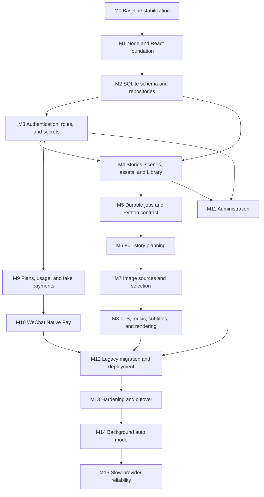

# Podcast Story Platform Implementation Plan

Status: Deterministic implementation complete; external production launch gates remain

Date: 2026-08-16

Source specification: `docs/PODCAST_PLATFORM_DESIGN_SPEC.md`

## 1. Objective

Implement the approved StoryVideoGen redesign as a Node.js/TypeScript web product backed by SQLite and local disk, while retaining the existing Python generation code as a private versioned media worker.

The delivery is complete when a user can:

1. Register and sign in.
2. Paste and save a full story of up to the approved operating limit.
3. Plan the complete story into editable scenes.
4. Generate or search for multiple image candidates, upload a manual image, and select one image per scene.
5. Generate per-scene narration and render a 1920×1080 MP4 with downloadable SRT.
6. Leave and return while durable work continues or recovers after restart.
7. View drafts, active work, failures, and completed episodes in a library.
8. View a subscription, usage, and WeChat Native Pay purchase flow.
9. Manage personal provider keys.

An admin must be able to list users and story metadata, inspect audited support details, and manage platform provider keys.

### Implementation status

Update this table only after the milestone's targeted Playwright gate, cumulative verification, and review pass have completed.

| Milestone | Status | Verification evidence |
|---|---|---|
| M0 | Complete | Clean Python 3.12 editable install; 2 Node tests; 80 Python tests; Vite build; targeted `@m0` 5/5 and cumulative Playwright 5/5; `npm run verify` passed on 2026-08-16. Review found and added persistent launcher regression coverage. |
| M1 | Complete | Strict Node/Fastify and React/Vite foundation; safe health, SPA, asset, and error behavior; approved 240px/72px/drawer navigation; 7 Node/launcher tests; targeted `@m1` 4/4 and cumulative Playwright 9/9; `npm run verify` passed on 2026-08-16 after the review pass. |
| M2 | Complete | `better-sqlite3` connection safety; six strict, checksummed, forward-only migrations; prepared migration/status repositories; rollback and backup documentation; 17 Node/launcher tests; targeted `@m2` 2/2 and cumulative Playwright 11/11; `npm run verify` passed on 2026-08-16 after the review pass. |
| M3 | Complete | Python-compatible PBKDF2 authentication; hashed persisted sessions with CSRF/revocation/expiry; server-side roles and idempotent admin promotion; AES-256-GCM personal provider credentials with user/platform resolution; 21 Node/launcher tests; targeted `@m3` 2/2 and cumulative Playwright 13/13; `npm run verify` passed on 2026-08-16 after enumeration-timing and constant-time CSRF review fixes. |
| M4 | Complete | Owner-scoped story/scene/prompt/asset services; 30,000-word validation; optimistic autosave and conflict handling; atomic content-validated local image uploads with ID-only streaming; searchable/filterable Library with archive eligibility and cleanup disabled; 23 Node/launcher tests; targeted `@m4` 3/3 and cumulative Playwright 15/15; `npm run verify` passed on 2026-08-16 after versioned split/merge and prompt CRUD review fixes. |
| M5 | Complete | Transactional idempotent jobs; short leased claims, heartbeat/retry/recovery/cancellation; monotonic polling and SSE events; separate Node worker supervising a versioned Python 3.12 NDJSON contract with allowlisted environment, bounded output/timeouts, redaction, process termination, and storage-root containment; 24 Node/launcher tests and 82 Python tests; targeted `@m5` 3/3 and cumulative Playwright 18/18; `npm run verify` passed on 2026-08-16 after SSE lifecycle, E2E run isolation, parallel rate-limit configuration, and worker result/path leakage review fixes. |
| M6 | Complete | Exact full-source planning with bounded windows, strict validation, bounded retry and deterministic fallback; encrypted Zhipu credential resolution; configurable 15–120 second target scene length with a 30-second default; Simplified Chinese narration and image prompts; scene review/edit/split/merge UI; targeted `@m6` and cumulative deterministic Playwright passed. |
| M7 | Complete | Durable one-to-four candidate jobs (two by default); retained Zhipu/SiliconFlow/Baidu/Pixabay/Openverse/Wikimedia adapters with common contract coverage; public-HTTPS/SSRF/redirect/size/MIME/dimension validation; provider metadata, per-candidate failure isolation, manual upload, selection, and source UI; 24 Node/launcher tests and 91 Python tests; targeted `@m7` 1/1, cumulative deterministic Playwright 20/20, and live `@live-zhipu-image` 1/1 with exactly one `glm-image` request; `npm run verify` passed on 2026-08-17 after the review pass. |
| M8 | Deterministic complete | Per-scene cached Edge TTS in production with silent fixture narration for deterministic tests, selectable Chinese voice, exact measured scene timing, optional rights-attested music, short timed subtitle cues burned into every MP4 plus external SRT/narration/credits, and 1920×1080 H.264/AAC render assets; targeted `@m8` 1/1 and cumulative deterministic Playwright passed. The combined live Zhipu gate was not repeated because the explicitly authorized one-image budget was consumed by M7. |
| M9 | Complete | Trial/Creator plan seeds, lazy trial, quotas/usage, idempotent fake pending/paid/failed flows, same-plan extension, entitlement gates, order history, and expiry behavior. Both plans now grant 1,000 image assets, and startup seeding refreshes existing plan rows safely; targeted `@m9` 1/1 and cumulative verification passed. |
| M10 | Production boundary complete; merchant adapter pending | RSA-SHA256 timestamped signature verification, AES-256-GCM callback-resource decryption, fake test adapter, browser-forgery rejection, and visibly fail-closed production mode; targeted `@m10` 1/1 and cumulative verification passed. Real Native Pay order/callback/reconciliation remains a launch gate until merchant configuration and a merchant test environment are supplied. |
| M11 | Complete | Role-scoped user/story administration, suspension enforcement, metadata-only default, reasoned audited support access, and encrypted platform-key rotate/disable without secret return; targeted `@m11` 1/1 and cumulative verification passed. |
| M12 | Deterministic complete | Dry-run-safe and idempotent legacy user/key/story/scene/prompt/image-selection/media import, encrypted provider keys, forced re-login, authenticated sampled download, Node API/worker systemd units, Node-only Caddy proxy, and backup/restore/rollback procedures; targeted `@m12` 1/1 and cumulative verification passed. VPS restore/cutover rehearsal remains an external launch gate. |
| M13 | Deterministic complete; release gates pending | 30,000-word browser boundary, suspended/expired/user/admin authorization coverage, HTTP hardening, serialized shared-queue E2E isolation, full registration-to-render/download regression, and final review fixes; targeted `@m13` 2/2 and cumulative Playwright 26/26. Fresh `npm run verify` passed on 2026-08-17 with 26 Node tests and 91 Python tests. A renewed one-image authorization, merchant acceptance, and production Caddy/backup rehearsal are still required for launch. |
| M14 | Complete | One-click auto mode durably chains full-story planning, independent per-scene image jobs, first-success selection, and final rendering, with startup handoff reconciliation and transactional multi-worker idempotency. The browser leaves/reopens the story while two workers claim scene jobs concurrently; targeted `@m14` and cumulative Playwright 27/27 passed. Fresh `npm run verify` passed on 2026-08-17 with 26 Node tests and 91 Python tests after the final review pass. |
| M15 | Complete | Slow image work streams progress, allows ten-minute Zhipu image responses, uses a twelve-minute silence budget, and stops after the first successful image per scene while retaining a second fallback attempt. Auto failures preserve actionable quota errors against the configured limit. The supplied SCP-173 story completes to MP4 in both the compressed slow-provider `@m15` regression and the authorized live Zhipu browser journey. The live run exposed and verified fixes for the required Edge TTS dependency and MP3 worker-artifact validation; its uninterrupted rerun completed real Zhipu planning, two scene-image jobs, Edge TTS, burned subtitles, persistence, and MP4 download validation in 4.8 minutes. Current verification covers 29 Node tests, 96 Python tests, and 29 deterministic Playwright journeys, plus all three live Zhipu gates. |

## 2. Approved implementation constraints

- Node.js 24 LTS and TypeScript own HTTP, authentication, authorization, SQLite, jobs, billing, administration, and the browser contract.
- Python 3.12 remains the private media/provider engine. No Node rewrite of the current generator is planned.
- React and Vite provide the browser UI.
- Fastify is the Node HTTP framework.
- SQLite with `better-sqlite3`, WAL, foreign keys, explicit migrations, and short transactions is the source of truth.
- Generated media is stored on local VPS disk and referenced by opaque database IDs.
- Caddy is the only public process and proxies to one Node API process.
- One separate Node worker process claims durable SQLite jobs and spawns Python without a shell.
- Full-story narration only; no excerpt, summarization, or abridgement path.
- Version 1 output is H.264/AAC MP4 at 1920×1080 with burned-in Simplified Chinese subtitles plus an external SRT.
- Image sources are the existing AI-generation providers, existing Baidu/Pixabay/Openverse/Wikimedia search providers, and manual upload. No new image-search integration is added.
- WeChat Native Pay is prepaid, not recurring. A fake adapter remains the default until merchant configuration is ready.
- Local disk, a small fixed worker pool, and one host define the initial scale boundary.
- Existing unrelated worktree changes are preserved. Each implementation milestone must limit edits to its declared scope.

## 3. Engineering principles

### 3.1 KISS and YAGNI

- Use one repository, one Node codebase with server and worker entry points, one SQLite database, and one local asset store.
- Do not add Redis, PostgreSQL, object storage, Kubernetes, a workflow platform, or microservices in version 1.
- Do not introduce a generic provider marketplace. Implement the approved adapters behind small interfaces.
- Do not implement social publishing, automatic payment renewal, impersonation, or arbitrary mobile layout parity.

### 3.2 SOLID boundaries

- Route handlers validate/authorize and call application services; they do not contain SQL or provider logic.
- Repositories own SQL for one feature domain.
- The job runner depends on a versioned media-worker interface, not Python module internals.
- Billing entitlement checks are separate from payment-provider calls.
- Asset authorization is centralized and uses asset IDs, not paths.
- Provider adapters return normalized results and do not update story state directly.

### 3.3 DRY without premature abstraction

- Share request schemas, API result types, story/job states, and error codes between Node server and React.
- Share provider normalization and asset validation once real adapters consume them.
- Keep feature-specific repositories and services separate until duplication is proven.

### 3.4 Cumulative browser gate

Every milestone must pass its new Playwright scenarios and the complete deterministic Playwright suite from all earlier milestones before it is considered complete. Unit and integration coverage cannot substitute for a required browser journey.

## 4. Dependency sequence



M9 and M11 can proceed after their dependencies while M6-M8 are being implemented, but they must not create a second job, user, or secret model.

## 5. Target repository layout

```text
server/
  migrations/
  src/
    index.ts
    worker.ts
    config.ts
    http/
    db/
    auth/
    stories/
    jobs/
    assets/
    providers/
    billing/
    admin/
    media-worker/
web/
  src/
    app/
    components/
    features/
    routes/
storyvideogen/
  worker_cli.py
  worker_contract.py
  ...existing generation modules...
tests/
  ...existing Python tests...
  contract/
e2e/
deploy/
docs/
```

The root `package.json` remains the command entry point. Avoid npm workspaces unless separate package publishing becomes necessary.

## 6. Cross-cutting contracts to define first

### 6.1 Identifiers and timestamps

- Use application-generated UUID/ULID text IDs for public entities.
- Never expose SQLite row IDs or storage paths.
- Use UTC RFC 3339 timestamps.
- Use integer milliseconds, bytes, and fen for duration, size, and money.

### 6.2 API errors

Standard error body:

```json
{
  "error": {
    "code": "STORY_VERSION_CONFLICT",
    "message": "This story changed in another session.",
    "requestId": "...",
    "details": {}
  }
}
```

Provider details, stack traces, filesystem paths, and secrets never appear in browser errors.

### 6.3 Story and job state

Define one shared TypeScript state module matching the approved state machines. Persist state explicitly. Every transition requires:

- Allowed previous state.
- Updated entity version.
- Job event/audit entry where applicable.
- Defined retry/cancellation behavior.
- Defined downstream invalidation behavior.

### 6.4 Python worker protocol

Invocation:

```text
<python-executable> -m storyvideogen.worker_cli <operation> --request <private-json-path>
```

The Node process uses `spawn(executable, args, { shell: false })`.

Version 1 request envelope:

```json
{
  "contractVersion": 1,
  "jobId": "...",
  "storyId": "...",
  "operation": "plan_story",
  "storageRoot": "...",
  "input": {},
  "settings": {},
  "credentialEnvironment": ["ZAI_API_KEY"]
}
```

Python writes newline-delimited JSON events with `contractVersion`, `jobId`, `sequence`, `type`, and a type-specific payload. Node rejects unknown versions, out-of-order job IDs, invalid JSON, and undeclared asset paths.

### 6.5 Normalized image-source result

```ts
interface ImageSourceResult {
  provider: string;
  providerResultId?: string;
  sourceKind: "generated" | "search" | "manual";
  sourcePageUrl?: string;
  imageUrl?: string;
  thumbnailUrl?: string;
  title?: string;
  creator?: string;
  licenseName?: string;
  licenseUrl?: string;
  width?: number;
  height?: number;
}
```

Only downloaded, validated local assets become candidates. A URL is never treated as a durable asset.

### 6.6 Asset invalidation

- Editing source story text invalidates the existing scene plan and every downstream asset after confirmation.
- Editing one scene's narration invalidates that scene's audio and final renders.
- Editing prompts invalidates only candidates created from the old prompt; previously selected image remains until a replacement is selected.
- Changing voice invalidates scene audio and final renders, not scenes/images.
- Changing music/volume invalidates final render only.
- A successful replacement is created before an old successful asset becomes inactive.

## 7. Milestone M0 — Stabilize the inherited baseline

### Goal

Create a reproducible build/test baseline without changing product behavior.

### Tasks

1. Configure setuptools package discovery to include only `storyvideogen*`; fix the observed editable-install failure.
2. Document and enforce Python 3.12 for the worker environment.
3. Pin Node 24 for development/deployment (`.nvmrc` or equivalent documented mechanism).
4. Add root scripts:
   - `test:python`
   - `test:unit`
   - `typecheck`
   - `build`
   - `test:e2e`
   - `test:e2e:live:zhipu`
   - `verify`
   - `verify:live:zhipu`
5. Make `verify` cross-platform by selecting `PYTHON` from configuration rather than relying on the current Windows `python` command, which resolves to Python 2.7.
6. Preserve all current tests and generated fixture behavior.
7. Add a baseline architecture note identifying the current SQLite and JSON formats for migration.
8. Tag the five inherited Playwright scenarios `@m0`, define the deterministic `chromium-desktop` project, exclude `@live-*` from the default project, and scaffold the separately invoked `live-zhipu` project without making a provider call.

### Expected files

- `pyproject.toml`
- `package.json`
- lockfiles
- optional small verification launcher under `scripts/`
- `README.md`

### Exit criteria

- Editable installation works in a clean Python 3.12 virtual environment.
- `npm run verify` runs 80+ Python tests, frontend build, and 5+ Playwright tests with no failure.
- Both `npm run test:e2e -- --grep "@m0"` and the cumulative `npm run test:e2e` pass with the same five inherited scenarios.
- No current story manifest or auth schema is changed.

## 8. Milestone M1 — Node API and React application foundation

### Goal

Introduce the production application runtime and minimal authenticated shell without replacing generation yet.

### Tasks

1. Add strict TypeScript configuration for browser and server.
2. Add Fastify bootstrap with:
   - configuration validation;
   - request IDs and structured logging;
   - secure body-size defaults;
   - normalized errors;
   - `/health/live` and `/health/ready`;
   - static serving of the Vite production bundle;
   - loopback bind by default.
3. Convert the current browser shell to React routes and reusable components.
4. Implement the approved left sidebar with admin navigation hidden until role data exists.
5. Create placeholder routes for Create, Library, Subscription, Settings, and admin pages.
6. Keep the current Python UI command available during migration; do not route Caddy to Node yet.
7. Add Node unit tests and the `@m1` Playwright smoke scenarios for route navigation.

### Expected files

- `server/src/index.ts`
- `server/src/config.ts`
- `server/src/http/*`
- `web/src/app/*`
- `web/src/routes/*`
- `web/src/components/*`

### Exit criteria

- Node serves the React bundle and health endpoints locally.
- Unknown routes/errors return safe JSON or SPA fallback as appropriate.
- Desktop/mobile sidebar behavior and keyboard navigation pass browser tests.
- Existing Python generation tests still pass.

## 9. Milestone M2 — SQLite migrations and repository foundation

### Goal

Make SQLite the authoritative metadata store with deterministic migrations.

### Tasks

1. Add one configured database connection per process using `better-sqlite3`.
2. Apply on every connection:
   - `foreign_keys = ON`;
   - WAL mode;
   - busy timeout;
   - defensive/safe settings supported by the library.
3. Add migration runner and schema version table. Migrations run before the server/worker accepts traffic, under an exclusive startup lock.
4. Create schema in dependency order:
   - `0001_identity.sql`: users and sessions;
   - `0002_provider_secrets.sql`;
   - `0003_stories.sql`: stories, scenes, prompts, candidates, assets;
   - `0004_jobs.sql`: jobs and events;
   - `0005_billing.sql`: plans, orders, events, subscriptions, usage;
   - `0006_admin_audit.sql`.
5. Add repository modules with prepared statements and explicit transaction helpers.
6. Add schema constraints and indexes from the design specification.
7. Add integration tests for migrations from empty DB and from every previous migration version.

### Expected files

- `server/migrations/*.sql`
- `server/src/db/database.ts`
- `server/src/db/migrate.ts`
- `server/src/db/transaction.ts`
- feature repository files

### Exit criteria

- Empty-database creation and repeated startup are deterministic.
- Foreign-key violations fail in tests.
- Migration rollback/backup instructions are documented.
- No HTTP handler contains raw SQL.

## 10. Milestone M3 — Authentication, roles, sessions, and encrypted provider keys

### Goal

Move account/security ownership to Node while preserving existing password compatibility.

### Tasks

1. Port verification of the current PBKDF2 password format using constant-time comparison.
2. Implement register, login, logout, current-user, password-change, CSRF, and session expiry endpoints.
3. Hash session tokens in SQLite and configure production cookies.
4. Add persisted `user` and `admin` roles plus active/suspended status.
5. Implement the one-time admin bootstrap command; make it idempotent and refuse ambiguous matches.
6. Add centralized owner/admin authorization hooks.
7. Implement provider-secret AES-256-GCM encryption using an external versioned master key.
8. Add personal provider settings endpoints and React UI showing configured/missing state only, including one Zhipu/ZAI credential (`ZAI_API_KEY`) with separate text/image capability-test statuses, plus SiliconFlow image and retained keyed-search rows.
9. Implement provider resolution: user key, eligible platform fallback, or actionable unavailable error.
10. Invalidate legacy sessions during final migration; do not attempt to copy active tokens.

### Security tests

- Login enumeration and rate limits.
- Cookie flags and CSRF.
- Session revocation/expiry.
- Cross-user secret access denial.
- Ciphertext tampering and wrong master-key version.
- Non-admin direct access to admin endpoints.
- Logs contain no credentials or cookies.

### Exit criteria

- Existing user password hashes authenticate after import.
- Provider values cannot be recovered through API responses/logs.
- Role enforcement is server-side and covered by integration tests.

## 11. Milestone M4 — Stories, scenes, assets, autosave, and Library

### Goal

Replace path/manifest-based product state with ID-based durable product APIs and UI.

### Tasks

1. Implement create/read/update/archive story services and owner-scoped routes.
2. Enforce the approved source-word limit before queueing planning; save a draft independently of generation.
3. Implement optimistic versioning for autosave and conflict responses.
4. Add scene CRUD required for split/merge and narration/prompt edits.
5. Implement local asset store:
   - server-generated storage keys;
   - atomic temporary writes;
   - content-based MIME/image validation;
   - checksum, size, dimensions/duration metadata;
   - ID-based inline/download routes;
   - streaming responses and owner checks.
6. Build Create and Library routes with status filters, search, pagination, empty/error states, and approved responsive behavior.
7. Implement archive and 30-day deletion scheduling, but keep destructive cleanup disabled until M12 backup/restore verification.
8. Add storage quota hooks without enforcing unapproved size pricing.

### Exit criteria

- Browser/API never receives server paths.
- Two tabs produce a version conflict instead of silent overwrite.
- User A cannot access User B's story/scene/asset by guessed ID.
- Draft and library states persist across server restart.

## 12. Milestone M5 — Durable SQLite jobs and Python worker contract

### Goal

Replace in-memory dictionaries, daemon threads, and the compose queue with resumable jobs.

### Tasks

1. Implement transactional job enqueue with unique idempotency keys.
2. Implement worker claim using a short immediate transaction, lease owner, and lease expiry.
3. Add heartbeat, bounded retries, next-attempt time, cancellation, and expired-lease recovery.
4. Append monotonic job events and expose owner-scoped SSE plus polling fallback.
5. Add `server/src/worker.ts` as a separate process entry point.
6. Add Python `worker_cli.py` and contract validation without changing media behavior.
7. Implement safe child-process supervision:
   - no shell;
   - explicit environment allowlist;
   - stdout NDJSON parser with size limits;
   - stderr redaction/truncation;
   - process-group cancellation;
   - wall-clock and silence timeouts.
8. Add fixtures for success, invalid JSON, crash, timeout, cancellation, duplicate completion, and restart recovery.
9. Keep all SQLite transactions closed while Python/provider/FFmpeg work runs.

### Exit criteria

- A queued/running fixture job survives API and worker restart.
- Duplicate start requests create one logical job.
- Cancelled work leaves previous successful assets intact.
- Invalid/malicious worker events cannot escape the assigned story storage root.

## 13. Milestone M6 — Full-story planning and scene editing

### Goal

Plan and narrate every accepted source word while retaining deterministic recovery.

### Tasks

1. Extract current translation, splitting, and prompt planning into the `plan_story` worker operation.
2. Remove `select_target_excerpt` from the product workflow; retain it only if CLI backward compatibility requires it.
3. Implement bounded input windows for long stories.
4. Maintain a story bible between windows: characters, locations, style, chronology, and previous-scene context.
5. Define strict LLM output schema with stable source offsets/coverage references.
6. Validate:
   - complete source coverage;
   - source order;
   - non-empty scenes;
   - scene word limits;
   - scene-count limit;
   - no duplicate/omitted ranges.
7. Retry invalid LLM output a bounded number of times, then use the deterministic splitter over the complete source.
8. Persist whether each scene came from LLM or fallback planning.
9. Extend the existing ZAI adapter for full-story planning, Simplified Chinese narration/translation, and image-prompt generation with separately configurable text models and strict JSON validation.
10. Add the `@live-zhipu-text` Playwright scenario: submit one bounded story through the real UI/API, assert the configured Zhipu/GLM model/provider and valid structured scene/prompt output, and fail without using the deterministic splitter.
11. Implement scene review UI, prompt editing, split/merge, and exact downstream invalidation rules.

### Test fixtures

- Short English story.
- Story at window boundary.
- Multi-window story with repeated sentences.
- Unicode punctuation and long paragraphs.
- Invalid/out-of-order/partial LLM output.
- Maximum accepted word count without calling a live provider.

### Exit criteria

- Automated coverage proves every source range appears exactly once and in order.
- No code path silently truncates to target duration.
- Editing one scene invalidates only documented downstream work.
- The `@live-zhipu-text` Playwright scenario passes with a provisioned Zhipu credential and deterministic fallback disabled.

## 14. Milestone M7 — Existing image providers, upload, and selection

### Goal

Integrate the existing image providers into durable story jobs without adding another search backend.

### Tasks

1. Adapt the existing `ImageProvider.fetch_image` contract to the durable job/asset model without rewriting provider behavior unnecessarily.
2. Retain Zhipu and SiliconFlow AI generation.
3. Retain the current Baidu, Pixabay, Openverse, and Wikimedia search adapters.
4. Do not add Brave, MCP, or any other search provider or search transport.
5. Preserve provider/source/license metadata when already available, but do not add image-rights verification, selection blocking, or attestation.
6. Keep safe download validation: allowed URL schemes, private-network blocking, bounded redirects, byte limits, MIME checks, and image-dimension limits.
7. Implement candidate generation, partial progress, retry, selection, prompt regeneration, and manual upload UI.
8. Enforce two default/four maximum candidates and successful-asset usage accounting hooks.
9. Add the `@live-zhipu-image` Playwright scenario that resolves credentials through the same scoped credential service used by production, requests exactly one `glm-image` candidate through the real UI/API, downloads it through the normal validation path, and never logs the key or authorization header.

### Exit criteria

- All providers pass one contract suite.
- Baidu remains available and its results can be selected.
- Existing provider/source metadata is preserved when supplied.
- Provider failure affects only its candidate/job and does not erase other results.
- No new image-search dependency or integration is introduced.
- The `@live-zhipu-image` Playwright scenario generates, displays, selects, and persists one validated image with fallback disabled.

## 15. Milestone M8 — Per-scene TTS, music upload, SRT, and rendering

### Goal

Produce a resumable long-form episode with accurate scene timing.

### Tasks

1. Extract `synthesize_scene_audio` from whole-story TTS behavior.
2. Cache audio by narration text, voice, provider/model, speed, and settings hash within the story.
3. Generate/validate per-scene duration and retime subtitles from actual audio.
4. Upload background music through the browser; remove server-path input.
5. Require music-rights attestation and persist it with the asset.
6. Add preview, volume, and loop controls.
7. Implement `render_episode` from selected images and scene audio using a generated FFmpeg concat plan.
8. Create final MP4, SRT, narration text, credits/license manifest, and safe download assets.
9. Burn the generated short subtitle cues into the MP4 and keep the same cues in the downloadable SRT; do not add optional burn-in modes or additional resolutions.
10. Make final render retryable from immutable input/checkpoint metadata.
11. Stream worker progress and capture redacted FFmpeg diagnostics.
12. Add the `@live-zhipu-full` Playwright scenario covering story creation, live Zhipu text planning, one live Zhipu image, selection, deterministic silent TTS, render completion, and authenticated MP4 download.

### Exit criteria

- Changing one scene narration regenerates that scene audio and the final render only.
- Changing music/volume reruns final render only.
- Worker restart does not repeat successful scene audio.
- A multi-scene offline fixture produces a playable 1920×1080 MP4 and valid SRT.
- The `@live-zhipu-full` Playwright scenario completes the cost-bounded live story-to-download journey with fallback disabled.

## 16. Milestone M9 — Plans, subscriptions, usage, and fake payments

### Goal

Implement billing-domain behavior independently of real WeChat credentials.

### Tasks

1. Seed one trial and one paid prepaid-period plan; load exact price/quota values from reviewed migration/config data.
2. Implement subscription/entitlement service and immutable usage ledger.
3. Gate cost-bearing planning/image/TTS/render starts while keeping draft/edit/download access per policy.
4. Charge only successful assets and make usage entry idempotent by job/output.
5. Implement fake payment provider for local/e2e environments with controlled pending/success/failure transitions.
6. Build Subscription page: current plan, expiry, usage, plan cards, order history, and payment modal.
7. Implement same-plan expiry extension transactionally.
8. Add admin-safe manual ledger adjustment service using additive entries.

### Exit criteria

- Duplicate success callbacks/commands extend entitlement once.
- Failed assets do not consume successful-output quota.
- Expired users retain edit/download access but cannot start cost-bearing work.
- Browser tests cover pending, success, failure, expiry, and quota-exceeded states without WeChat.

## 17. Milestone M10 — WeChat Native Pay

### Goal

Add a production-gated API v3 Native Pay adapter without weakening fake/local testability.

### Tasks

1. Implement merchant request signing and response verification with an audited library or narrowly tested crypto adapter.
2. Create Native orders with unique `out_trade_no`, integer fen, expiry, notify URL, and plan metadata.
3. Return only the internal order ID and QR content required by the UI.
4. Register a raw-body callback route outside session/CSRF middleware.
5. Verify timestamp, nonce, serial/public-key ID, signature, and anti-replay window before decryption.
6. Decrypt AES-256-GCM resource and validate merchant ID, app ID, order number, currency, amount, and trade state.
7. Persist notification ID/transaction ID and apply success idempotently in one database transaction.
8. Acknowledge verified callbacks promptly and process entitlement side effects safely.
9. Add pending-order query/reconciliation and order-close tasks.
10. Redact merchant keys, authorization headers, callbacks, and QR URLs from logs.
11. Keep the adapter disabled until merchant launch inputs and controlled acceptance tests are complete.

### Exit criteria

- Synthetic signed callback fixtures cover valid, duplicate, forged, stale, wrong-amount, wrong-merchant, and decrypt-failure cases.
- Browser-reported success cannot activate a subscription.
- Lost callback is recovered by reconciliation.
- Production enablement fails closed when any credential/configuration is absent.

## 18. Milestone M11 — Admin users, stories, support access, and platform keys

### Goal

Deliver the approved role-protected administration surface.

### Tasks

1. Build paginated Users and All Stories queries with approved filters/aggregates.
2. Add account status update service and audit log.
3. Limit default story view to metadata.
4. Implement explicit support-content access action requiring reason text; write audit event before returning access.
5. Build platform provider-key page using the same encrypted secret service at `platform` scope.
6. Add rotate, disable, and rate-limited test actions; never reveal stored secrets.
7. Add subscription/usage summary and manual adjustment workflow if operationally required.
8. Verify admin sidebar and every API route independently enforce role.

### Exit criteria

- Non-admin direct requests receive denial without resource-existence leakage.
- Every admin mutation/support access produces a request-linked audit record.
- Secret tests/rotation never return or log secret values.
- User and story list queries are paginated and indexed.

## 19. Milestone M12 — Legacy import, local-disk operations, and deployment

### Goal

Prepare a repeatable migration and production deployment while preserving rollback.

### Tasks

1. Implement dry-run legacy importer for:
   - existing auth SQLite users/password hashes/API keys;
   - `story_session.json`;
   - `interactive_project.json`;
   - image/audio/video/attribution manifests.
2. Map paths to new IDs/storage keys without copying media during dry run.
3. On real import, encrypt user keys, import metadata/assets, verify file checksums, and report skipped/corrupt records.
4. Make import idempotent with a legacy-source identity table.
5. Invalidate old sessions and require re-login.
6. Create systemd units for Node API, Node worker, and environment/credential files.
7. Update Caddy to proxy only to Node loopback and preserve HTTPS/security headers.
8. Restrict service users and storage permissions.
9. Add coordinated SQLite backup and local media snapshot procedure with 30-daily/12-monthly retention.
10. Add disk-space monitoring and safe cleanup of unreferenced temporary files.
11. Exercise restore into an isolated directory and run integrity/asset checks.
12. Document rollback to the Python UI during the cutover window.

### Exit criteria

- Dry run reports exact import counts and no writes.
- Repeated real import creates no duplicates.
- Restored database and media pass integrity and sample-download checks.
- Only Caddy listens publicly; Node/Python processes run non-root.

## 20. Milestone M13 — Hardening, performance validation, and cutover

### Goal

Prove the approved operating envelope or lower the launch limits explicitly.

### Tasks

1. Run the canonical full verification suite in a clean environment.
2. Run authorization matrix tests across user/admin/suspended/expired states.
3. Run process-restart tests during planning, image generation, TTS, and render.
4. Run long-story tests at increasing sizes through the approved 30,000-word target using fixture providers where live cost is unnecessary.
5. Measure planning memory, SQLite write contention, queue latency, disk growth, TTS/render duration, and API responsiveness.
6. Set initial worker concurrency and request/provider limits from measurements.
7. Run upload/download/path traversal, SSRF, malformed image, zip/decompression, CSRF, session, and log-redaction security tests.
8. Run payment idempotency/reconciliation acceptance with merchant test configuration when available.
9. Complete backup restore drill and rollback rehearsal.
10. Resolve high-confidence review findings only; defer speculative refactors.
11. Run `npm run verify:live:zhipu` against the release candidate with one explicitly provisioned production-equivalent credential used for one structured text request and one generated image, fallback disabled, and redacted logs retained for review.
12. Freeze the final launch configuration and publish support/privacy/refund/retention copy.

### Exit criteria

- The measured launch limit is documented. If 30,000 words/four hours does not pass, the UI/config uses the measured safe lower cap until capacity improves.
- No critical/high security or data-loss finding remains.
- Recovery, payment, and authorization acceptance criteria pass.
- The release-candidate Zhipu/GLM-planning-to-Zhipu-image-to-render smoke test passes without provider fallback or credential disclosure.
- Caddy cutover and rollback have both been rehearsed.

## 21. Verification matrix

| Area | Unit | Integration | Browser/E2E | Operational |
|---|---|---|---|---|
| Auth/roles | Hash/session/CSRF policy | SQLite and HTTP authorization | Login/settings/admin denial | Bootstrap and session invalidation |
| Stories/scenes | State/invalidation/version | Repository/API ownership | Create/autosave/edit/library | Legacy import |
| Jobs | Lease/retry/idempotency | Worker restart and SSE | Progress/cancel/retry | Worker crash/restart |
| Planning | Coverage validator/window merge | Python contract | Full-story review | Maximum-size run |
| Images | Existing provider contract | Downloads/provider fixtures | Generate/search/select/upload | Provider rate-limit behavior |
| Audio/render | Cache keys/timing | Offline FFmpeg fixture | Configure/render/download | Long render/restart/disk |
| Billing | Entitlement/ledger/order states | Fake provider/callback | Plan/QR/status/expiry | Reconciliation |
| WeChat | Signature/decrypt/idempotency | Synthetic signed callback | Payment status only | Controlled merchant acceptance |
| Admin | Policy/audit | Role-scoped queries | Users/stories/keys | Audit review |
| Deployment | Config validation | Clean install/migrations | Smoke test through Caddy | Backup/restore/rollback |

### 21.1 Playwright gate policy

Playwright is the authoritative browser end-to-end framework. Tests use milestone tags in their titles or annotations (`@m0` through `@m15`) and live-provider tags beginning with `@live-`. Each milestone runs both commands:

```text
npm run test:e2e -- --grep "@mN"
npm run test:e2e
```

Replace `N` with the current milestone number. The targeted command proves the newly introduced browser behavior; the second command is cumulative and proves no earlier journey regressed.

A milestone's Playwright gate passes only when:

- all required scenarios in the corresponding row below pass;
- every deterministic Playwright scenario from M0 through the current milestone passes;
- required scenarios contain no `skip`, `fixme`, unexpected failure, or retry-only/flaky pass;
- tests use isolated temporary SQLite and media roots, never developer or production data;
- provider, payment, clock, and long-running worker behavior use deterministic fixtures unless the row explicitly requires the live project;
- failure artifacts retain a trace, screenshot, browser console, relevant server/worker logs, and request ID with credentials redacted.

The normal `npm run test:e2e` command excludes `@live-*`. Playwright configuration provides a deterministic `chromium-desktop` project, selected mobile-viewport coverage where required, and a separately invoked `live-zhipu` project. A milestone cannot close on unit/integration tests alone.

### 21.2 Required Playwright scenarios by milestone

| Milestone | Targeted Playwright scope | Required passing scenarios before milestone exit |
|---|---|---|
| M0 | `@m0` inherited baseline | Existing account settings/password, draft restore, prepared image choices, composed downloads, and left-navigation scenarios pass in Chromium; the Python 3.12 web-server launcher is selected explicitly. |
| M1 | `@m1` application shell | Node serves the React app; Create, Library, Subscription, Settings, and role-appropriate placeholder routes navigate correctly; unknown routes are safe; desktop sidebar, mobile drawer, focus order, and keyboard navigation work. |
| M2 | `@m2` database bootstrap | The app boots on a fresh temporary SQLite database, boots again after migration without duplicate state, reports ready only after migrations, and renders a safe unavailable state when a deliberately broken migration fixture prevents readiness. |
| M3 | `@m3` identity and keys | Register, login, logout, password change, session expiry/revocation, CSRF rejection, user/admin navigation, non-admin direct-route denial, Zhipu/ZAI key save/status/rotate/delete, and no-secret-return behavior pass. |
| M4 | `@m4` stories and Library | Create and autosave a full draft, restore after reload/server restart, show a two-tab version conflict, filter/search/paginate Library states, archive without immediate deletion, stream an owned asset, and deny a second user guessed story/asset IDs. |
| M5 | `@m5` durable jobs | Queue once under duplicate clicks, receive ordered progress, reload while running, cancel, retry an eligible failure, recover after API/worker restart through the test harness, and deny cross-user job/event access. |
| M6 | `@m6` full-story planning | Submit a multi-scene fixture, prove first and last source ranges appear exactly once and in order, display deterministic-fallback status when fixture LLM output is invalid, edit/split/merge scenes, and show only documented downstream invalidation. |
| M7 | `@m7` images | Generate fixture candidates with partial progress/failure, retain and select a Baidu fixture result, regenerate a prompt, upload and validate a manual image, enlarge/select one candidate per scene, block continuation when a scene lacks selection, and deny unsafe downloads/uploads. |
| M8 | `@m8` audio and render | Configure a voice, preview fixture audio, upload/attest/preview music, render with selected images and silent fixture TTS, reload during render, retry after a worker restart, verify burned-in subtitles, play/download MP4, and download matching SRT/narration/credits assets without filesystem paths. |
| M9 | `@m9` subscription with fake payment | Display plan/usage/order history, exercise pending/success/failure/expiry flows, extend the same plan once, enforce quota and expired-plan generation blocks, and preserve draft/edit/prior-download access. |
| M10 | `@m10` WeChat UI boundary | Display Native Pay QR content and internal order status, handle pending/expired/closed/reconciled states, prove a browser-forged success cannot activate entitlement, and keep production payment visibly disabled when merchant configuration is incomplete. Cryptographic callback cases remain integration tests. |
| M11 | `@m11` administration | Hide admin navigation from users; deny direct admin API/page access; paginate/filter Users and All Stories; keep story content metadata-only by default; require a reason for audited support access; and save/test/rotate/disable platform keys without revealing values. |
| M12 | `@m12` migration and deployment | An imported legacy user must re-login, see imported drafts/completed media, download a sampled asset, and see configured-key status without the value; a deployment Playwright project reaches the Node app through Caddy after restore into an isolated root. |
| M13 | `@m13` release regression | Run the complete user journey from registration through story creation, planning, image selection, audio/render, Library recovery, and download; run subscription/admin authorization regressions; exercise cutover/rollback smoke targets; then pass every deterministic Playwright scenario from M0–M13. |
| M14 | `@m14` background auto mode | Start one-click generation from a full draft, finish planning in one worker, claim two scene-image jobs concurrently, leave for Library while work continues, verify the first successful candidate is selected per scene, queue/render the final MP4, reopen the completed story, and prove all stage jobs remain durable. |
| M15 | `@m15` slow-provider reliability | Use the supplied SCP-173 story with a compressed slow provider whose first candidate fails, prove streamed progress keeps both scene jobs alive, stop after the first successful fallback image, render/play the MP4, and separately prove a post-planning quota failure reaches the browser with its exact actionable message. |

### 21.3 Live Zhipu Playwright gate

Live provider checks are Playwright scenarios in the separately invoked `live-zhipu` project:

The live project uses a dedicated verification account and an ignored, non-production verification database. Before the first live run, the operator saves the shared `ZAI_API_KEY` through that account's Settings page; Playwright only checks configured capability status and never types, copies, logs, or returns the stored value. Per-run story and media artifacts use a fresh isolated root and are cleaned after success.

| Boundary | Required tag | Required outcome |
|---|---|---|
| After M6 | `@live-zhipu-text` | One small full story is planned through the UI with real Zhipu/GLM text generation; structured output, complete coverage, provider/model metadata, and no deterministic fallback are asserted. |
| After M7 | `@live-zhipu-image` | One real `glm-image` candidate is requested through the UI, validated, persisted, displayed, and selected with no image-provider fallback. |
| After M8 and M13 | `@live-zhipu-full` | One cost-bounded story completes Zhipu text planning, one Zhipu image, selection, silent TTS, FFmpeg render, browser playback metadata, and authenticated download with no fallback or secret leakage. |
| After M15 | `@live-zhipu-auto` | The supplied SCP-173 story completes the real background auto pipeline with Zhipu text and first-success image generation, Edge TTS, FFmpeg MP4, durable job/selection assertions, extended slow-provider time budgets, and no credential leakage. |

`npm run test:e2e:live:zhipu` runs the live project directly for targeted diagnosis. `npm run verify:live:zhipu` runs all live tags available at the current boundary and becomes the full `@live-zhipu-full` release gate after M8. These commands require explicit operator confirmation because they call a paid production provider.

## 22. Canonical verification command

Milestone M0 must create one command that later milestones extend:

```text
npm run verify
```

Before final handoff it must cover, in order:

1. TypeScript typecheck.
2. Node unit/integration tests.
3. Python unit/render/contract tests under Python 3.12.
4. Vite production build.
5. The complete deterministic Playwright suite through the current milestone, following Section 21; no required skipped or flaky scenarios are accepted.
6. Migration smoke test against a new temporary SQLite database.

Full-duration and WeChat merchant tests remain separate opt-in commands so routine verification is deterministic and does not spend money. Live Zhipu verification is also excluded from routine CI, but the combined text-plus-image path is a mandatory release-handoff gate rather than an optional check.

Run the release-gated end-to-end check with:

```text
npm run verify:live:zhipu
```

The command must:

1. Resolve one `ZAI_API_KEY` with production precedence: the authenticated user's encrypted credential, then the eligible platform credential. Local/operator execution may use `ZAI_API_KEY`; Zhipu image-only aliases remain supported outside this combined check but do not satisfy its text stage.
2. Fail explicitly with `LIVE_ZHIPU_KEY_MISSING` when the shared credential is absent. It must not use example values, test fixtures, another text/image provider, the deterministic text fallback, or a placeholder image.
3. Create an isolated temporary user/story/job through the Node API and dispatch through the private versioned Python worker boundary.
4. Send a small complete story through Zhipu/GLM, using the configured launch text model, and assert valid structured full-story scenes plus visual prompts before persisting provider/model metadata.
5. Use one resulting prompt to request exactly one image from Zhipu `glm-image` to bound cost.
6. Download the result through normal URL, byte, MIME, and dimension validation; persist and select the asset; use deterministic silent TTS; and render a short MP4 through the normal FFmpeg path.
7. Assert successful job events, complete source coverage, a non-empty decodable image, a playable non-empty video, and no secret or bearer token in captured logs.
8. Remove temporary database/media artifacts after success and retain redacted diagnostics after failure.

The live command is run at the M6 text boundary, M7 image boundary, Checkpoint C after M8, and again against the release candidate during M13, using the applicable Playwright tags from Section 21.3. The credential is provisioned immediately before the check and is never committed to the repository.

## 23. Review checkpoints

Perform an explicit review after these boundaries:

- **Checkpoint A after M3**: schema, authentication, role, encryption, and migration review.
- **Checkpoint B after M5**: durable job semantics and Node/Python security review.
- **Checkpoint C after M8**: end-to-end generation, provider metadata, local-storage review, and successful `npm run verify:live:zhipu` across Zhipu/GLM text and Zhipu image generation with fallback disabled.
- **Checkpoint D after M10**: payment cryptography, idempotency, reconciliation, and entitlement review.
- **Checkpoint E after M12**: import, backup/restore, deployment, and rollback review.
- **Final review after M13 and M14**: current diff, full verification, residual risks, and launch-gate status.

At each checkpoint, inspect the actual diff before changing code, fix only high-confidence issues, and rerun the relevant full verification command.

## 24. Known risks and controls

| Risk | Control |
|---|---|
| 30,000-word/four-hour target exceeds one-host capacity | Windowed planning, per-scene checkpoints, fixture load tests, measured launch cap |
| SQLite writer contention | Short transactions, one API process, small worker count, WAL, busy timeout, queue metrics |
| Worker/provider crash loses progress | Durable leases/events, idempotent stage outputs, atomic assets, restart tests |
| Search-provider download is unsafe or malformed | URL/IP checks, bounded downloads, MIME/dimension validation |
| API keys leak through DB/logs/child processes | AES-GCM at rest, external master key, least-scope injection, systematic redaction |
| Live verification silently uses fake or fallback text/images | Dedicated Zhipu command, explicit missing-key failure, one text and one image request cost cap, persisted provider/model assertions |
| WeChat duplicate/forged callbacks | Raw-body signature verification, decryption validation, unique event IDs, transactions, reconciliation |
| Local disk loss or exhaustion | Coordinated backups, restore drills, quotas, disk alerts, temp cleanup |
| Legacy JSON/SQLite import corrupts state | Dry run, idempotency, checksums, fixture matrix, rollback window |
| Existing dirty changes are overwritten | Scope each milestone, inspect status/diff before edits, never reset unrelated work |

## 25. Launch gates

Implementation may reach feature-complete with fake providers, but production launch requires:

- Exact plan price and quota seed values.
- WeChat merchant onboarding and secrets, or billing remaining visibly disabled.
- Production domain/VPS and successful Caddy deployment.
- Provider commercial-use and regional acceptance checks.
- Initial admin bootstrap and secure credential storage.
- Successful release-candidate `npm run verify:live:zhipu` using one explicitly provisioned Zhipu credential for text and image generation, with fallback disabled and redacted logs reviewed.
- Public privacy, retention, refund, invoice, and support policies.
- Successful local-disk backup/restore exercise.
- Measured worker concurrency and safe maximum story/output limits.
- Account recovery identity before public paid self-service registration.

## 26. First implementation slice

Begin with M0 only. Do not simultaneously introduce the Node server and repair the inherited packaging baseline. M0 is complete only when a clean environment has one reliable verification command. Then implement M1 and M2 in order.

Before executing any commit, push, schema migration against real data, package-global installation, or deployment change, follow the repository's explicit dangerous-operation confirmation policy.
